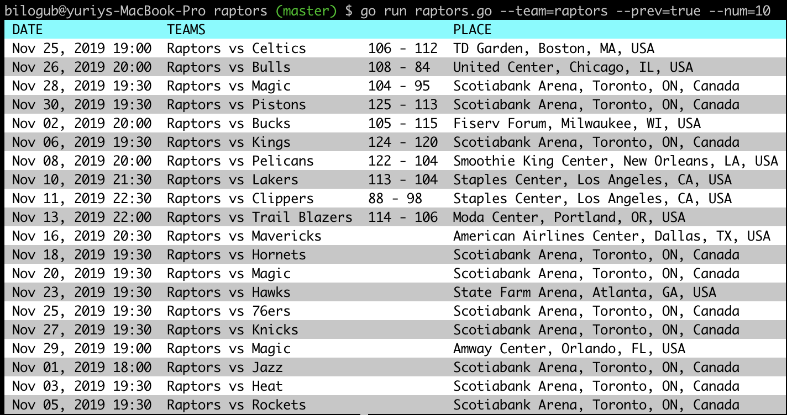

Raptors Games schedule for busy developers
-
[](https://goreportcard.com/report/github.com/bilogub/go-raptors)
[](https://circleci.com/gh/bilogub/go-raptors)



Outputs:
-

1. Next 5 games for game selected team. Default is Raptors NBA team.
2. Shows current game score and quarter during the game.

**Keys available:**

`--team` - to select the team. Type: string, default: "raptors"

`--num` - number of records to display(next N and previous N games). Type: integer, defaut: 5

`--prev` - controls previous games output. Type: boolean, default: false

Example:
-
```sh
raptors --team=raptors --num=10 --prev=true
```
Or just `raptors` that will show next 5 games for Raptors team.

Installation:
-

1. Build it with Golang
2. For ease of use - rename built binary to `raptors` and move to `/usr/local/bin`
3. Launch it in your terminal with `raptors`
4. Follow the schedule and enjoy the games!

